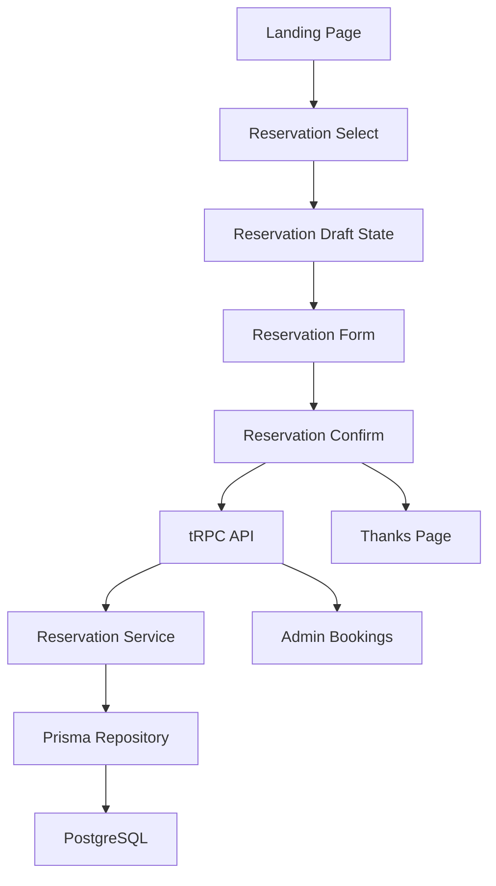
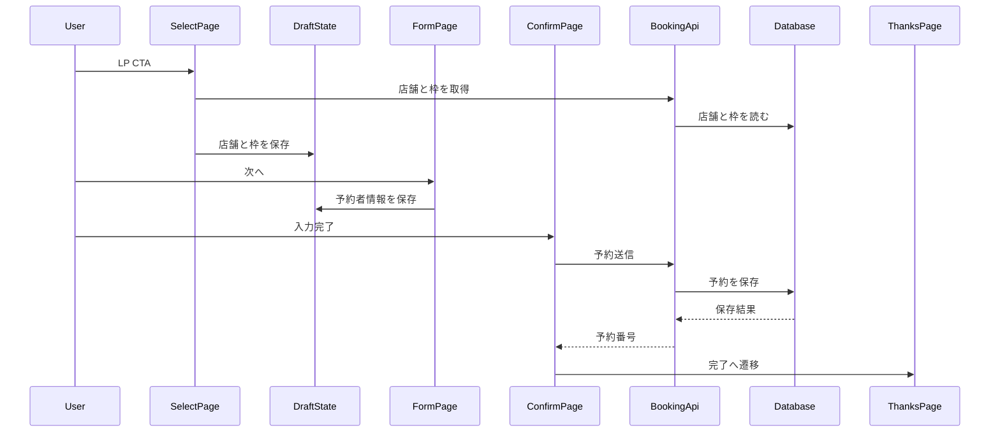
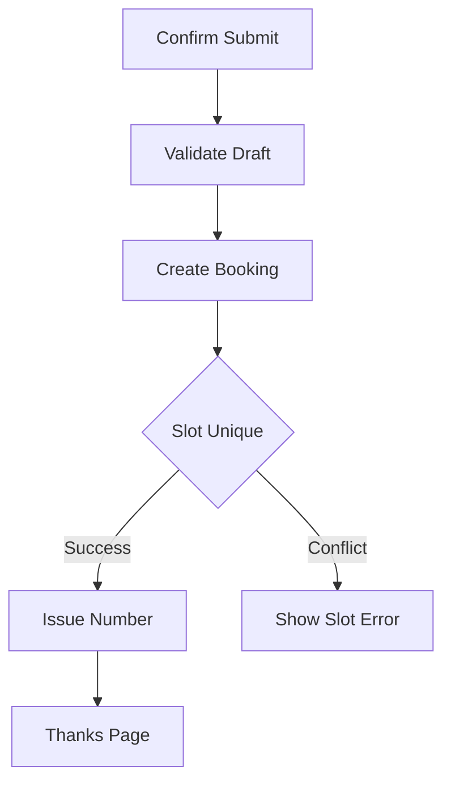
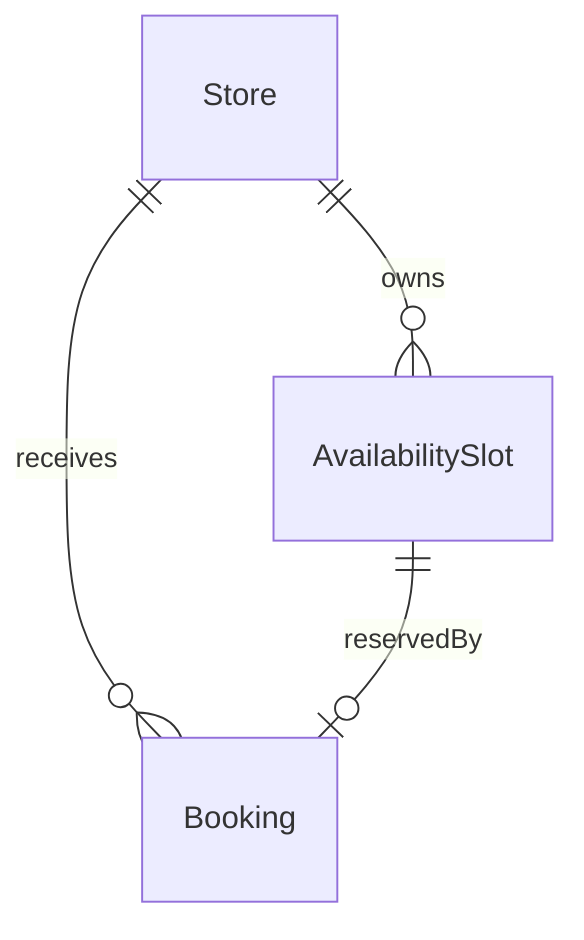

# Design Document

## Overview
本機能は、スクレイピング練習用の架空トレーニングジムLPとして、T3 App上にLP、店舗選択、体験予約フロー、最小限の管理ログイン、管理用店舗一覧、店舗別予約一覧を実装する。見込み客はLPから予約画面へ進み、都道府県、店舗、予約可能枠、予約者情報、確認画面を経て予約番号付きの完了画面に到達する。運営者はログイン後に店舗一覧から対象店舗を選び、予約日時昇順の予約一覧を確認する。

対象ユーザーは、体験トレーニングを予約する見込み客と、最小限のログイン後に店舗別の予約状況を確認する運営者である。現在はWebアプリ本体がないため、T3 App、PostgreSQL、Prisma、tRPC、Tailwind CSSを新規に導入し、要件で定義されたURLとデータ保存を一貫した型安全な境界で提供する。

### Goals
- LPから予約完了までの分割画面フローを実装し、直接アクセス時の戻し動作を統一する。
- 店舗、予約可能枠、予約をPostgreSQLに保存し、1枠1名限定の競合制御をDB制約とサーバー処理で保証する。
- スクレイピング練習用の安定した`id`/`data-scrape`属性を全対象画面へ付与する。
- 架空LPとして関東地方の店舗seedを用意し、実在店舗や実運用予約と混同されないデータにする。
- 関東地方の都県のみを予約対象とし、初期データ件数を固定してE2Eとスクレイピングの再現性を保つ。

### Non-Goals
- 複数管理者アカウント管理、ロール権限管理、決済、メール送信、SMS通知、外部カレンダー同期、CRM連携。
- 予約枠のリアルタイム在庫管理、枠ロック、スタッフ別スケジュール管理。
- 予約ステータス更新やキャンセル管理。

## Boundary Commitments

### This Spec Owns
- `/`、`/reservation`、`/reservation/form`、`/reservation/confirm`、`/reservation/thanks`、`/admin/login`、`/admin/bookings`、`/admin/bookings/{storeId}`の画面と遷移。
- 店舗、予約可能枠、予約、予約番号のデータモデルと永続化。
- 30日先まで、全店舗共通10:00-20:00、1時間単位、1枠1名の予約作成制約。
- 関東地方のみの都道府県表示、東京都10店舗・神奈川県/千葉県/埼玉県各4店舗・栃木県/群馬県/茨城県各1店舗の初期データ。
- 最小限の管理ログイン、管理用店舗一覧、店舗別予約一覧の予約日時昇順表示。
- スクレイピング練習用の安定HTML属性。

### Out of Boundary
- 複数管理者アカウント、ロール権限制御、パスワード変更、ログアウト以外の認証管理。
- 予約枠在庫のリアルタイム更新、スタッフ単位の予定管理、枠ロック。
- 決済、メール/SMS通知、外部カレンダー連携、CRM連携。
- 管理画面からの予約編集、キャンセル、ステータス更新。
- 実在店舗の掲載、実店舗への送客、実運用向け予約業務。

### Allowed Dependencies
- T3 App App Router構成。
- パッケージマネージャは`pnpm`。
- Next.js App Router、React、TypeScript、Tailwind CSS。
- tRPC、Zod、TanStack Query。
- 管理ログイン用のHTTP-only cookieと`.env`管理の管理者パスワードハッシュ。
- Prisma Client、PostgreSQL。
- Docker ComposeによるappコンテナとPostgreSQLコンテナ。
- 本番想定としてAzure App Serviceの単一appコンテナと外部PostgreSQLを許容する。
- Vitestによるユニット/統合テスト、PlaywrightによるE2Eテスト。

### Revalidation Triggers
- 予約URL、tRPC procedure、Zod schema、Prisma modelの形が変わる場合。
- 予約可能枠の範囲、1枠1名制約、予約番号形式が変わる場合。
- 管理一覧を店舗別以外に変更する場合。
- 複数アカウント、ロール権限、通知、決済、外部カレンダーなどOut of Boundaryの機能を追加する場合。

## Architecture

### Existing Architecture Analysis
既存アプリケーションコードは存在しない。`README.md`、Kiro文書、テンプレートのみがあるgreenfieldであるため、T3 Appをリポジトリ直下に作成し、生成される`src`、`prisma`、設定ファイル群に本機能のドメインファイルを追加する。

### Architecture Pattern & Boundary Map
**Architecture Integration**:
- Selected pattern: T3 App標準のApp Router UI + tRPC API + Prisma Repository。小さなフルスタック機能に対して過剰なレイヤーを避けつつ、UI、API、DB境界を明確にする。
- Domain/feature boundaries: UIは表示と画面状態、tRPC routerは入出力契約、serviceは予約ルール、repositoryはDB永続化を担当する。
- Existing patterns preserved: greenfieldのため既存パターンなし。Create T3 AppのApp Router構成に従う。
- New components rationale: 予約フロー、店舗検索、枠表示、予約作成、管理一覧が複数画面とDB整合性をまたぐため、UIとサーバー境界を分ける。
- Steering compliance: steering未整備のため、T3 App標準とspec要件を設計基準とする。



### Technology Stack

| Layer | Choice / Version | Role in Feature | Notes |
|-------|------------------|-----------------|-------|
| Frontend | Next.js App Router 16系, React 19系, TypeScript strict, Tailwind CSS | LP、予約フロー、管理一覧UI | App RouterのファイルベースURLを使用 |
| Backend / Services | tRPC 11系, Zod 4系 | 型安全なquery/mutationと入力検証 | Server ActionsではなくtRPCを主API境界にする |
| Data / Storage | Prisma 6系, PostgreSQL | 店舗、予約枠、予約保存 | `Booking.slotId`一意制約で1枠1名を担保 |
| Test | Vitest, Playwright | ユニット/統合テスト、E2Eテスト | `pnpm test`で実行できる構成にする |
| Messaging / Events | なし | 対象外 | 通知、外部連携はOut of Boundary |
| Infrastructure / Runtime | Docker Compose, Azure App Service single container想定, Node.js runtime, `.env` | 開発appコンテナ、開発PostgreSQLコンテナ、本番app単一コンテナ、環境変数管理 | 開発DB接続情報は`.env`、本番DBはNeonなど外部PostgreSQLの`DATABASE_URL`を想定 |

## File Structure Plan

### Directory Structure
```text
docker-compose.yml                 # 開発用appサービスとdbサービスを定義するコンテナ構成
Dockerfile                         # 開発appサービスとAzure App Service単一コンテナを兼ねるNode.js実行環境
prisma/
├── schema.prisma                  # Store, AvailabilitySlot, BookingのDB schema
└── seed.ts                        # 関東の架空店舗と30日分の予約可能枠の初期データ生成
src/
├── app/
│   ├── layout.tsx                 # アプリ共通レイアウト
│   ├── page.tsx                   # LP
│   ├── reservation/
│   │   ├── page.tsx               # 都道府県選択、店舗選択、カレンダー、枠選択
│   │   ├── form/page.tsx          # 予約者情報入力
│   │   ├── confirm/page.tsx       # 予約内容確認と送信
│   │   └── thanks/page.tsx        # 完了画面と予約番号表示
│   └── admin/
│       ├── login/page.tsx         # 管理者ログイン
│       └── bookings/
│           ├── page.tsx           # 管理用店舗一覧
│           └── [storeId]/page.tsx # 店舗別予約一覧
├── app/_components/
│   ├── landing-page.tsx           # LP主要セクション
│   ├── store-selector.tsx         # 都道府県と店舗一覧
│   ├── availability-calendar.tsx  # 30日分の空き枠カレンダー
│   ├── reservation-form.tsx       # 予約者情報フォーム
│   ├── reservation-summary.tsx    # 確認/完了共通サマリー
│   ├── admin-login-form.tsx       # 管理者ログインフォーム
│   ├── admin-store-list.tsx       # 管理用店舗一覧
│   └── admin-bookings-table.tsx   # 店舗別予約一覧テーブル
├── app/_state/
│   └── reservation-draft-store.ts # React ContextとsessionStorageによる画面間の予約ドラフト状態
├── server/
│   ├── api/
│   │   ├── root.ts                # appRouter統合
│   │   ├── trpc.ts                # publicProcedure定義
│   │   └── routers/
│   │       ├── store.ts           # 店舗と予約枠query
│   │       ├── booking.ts         # 予約作成mutationと管理一覧query
│   │       └── admin.ts           # 管理ログイン、店舗一覧、店舗別予約query
│   ├── db.ts                      # Prisma Client
│   ├── repositories/
│   │   ├── store-repository.ts    # 店舗/枠読み取り
│   │   └── booking-repository.ts  # 予約保存/一覧
│   └── services/
│       ├── availability-service.ts # 30日範囲と表示可能枠の整形
│       ├── booking-service.ts      # 予約番号、競合制御、作成ルール
│       └── admin-auth-service.ts   # 管理ログインとセッション確認
├── shared/
│   ├── reservation-schema.ts      # Zod schemaと推論型
│   ├── reservation-types.ts       # UI/API共有型
│   └── scrape-ids.ts              # id/data-scrape属性の定数
├── middleware.ts                  # 管理画面の最小セッション確認
└── trpc/
    ├── react.tsx                  # Client Components用tRPC
    └── server.ts                  # Server Components用tRPC
```

### Modified Files
- `package.json`、`pnpm-lock.yaml` — T3 App生成後のscriptsとPrisma seed scriptを`pnpm`前提で管理する。
- `.env.example` — `DATABASE_URL`、`POSTGRES_USER`、`POSTGRES_PASSWORD`、`POSTGRES_DB`、`POSTGRES_PORT`、`ADMIN_PASSWORD_HASH`、`ADMIN_SESSION_SECRET`を例示する。
- `.gitignore` — `.env`をコミット対象外として扱う。
- `README.md` — Docker Compose起動、Prisma migration、DB seed、確認URL、Azure App Service単一コンテナ想定を記載する。

## System Flows

### 予約フロー


### 競合制御


## Requirements Traceability

| Requirement | Summary | Components | Interfaces | Flows |
|-------------|---------|------------|------------|-------|
| 1.1 | LP情報表示 | LandingPage | UI props | 予約フロー |
| 1.2 | 予約導線表示 | LandingPage | UI props | 予約フロー |
| 1.3 | LPから予約画面へ遷移 | LandingPage | Next Link | 予約フロー |
| 2.1 | `/reservation`統合画面 | ReservationPage | Draft State | 予約フロー |
| 2.2 | 都道府県別店舗表示 | StoreSelector, storeRouter | `getStoresByPrefecture` | 予約フロー |
| 2.3 | 店舗なし表示 | StoreSelector | UI state | 予約フロー |
| 2.4 | 店舗選択状態 | StoreSelector, DraftState | Draft actions | 予約フロー |
| 2.5 | 関東固定の初期店舗件数 | seed, StoreRepository | seed dataset | 予約フロー |
| 2.6 | 店舗選択状態 | StoreSelector, DraftState | Draft actions | 予約フロー |
| 2.7 | 店舗未選択時の枠選択不可 | ReservationPage | UI guard | 予約フロー |
| 3.1 | 店舗情報表示 | StoreSelector | Store DTO | 予約フロー |
| 3.2 | 24時間営業表示 | StoreSelector | Store DTO | 予約フロー |
| 3.3 | 店舗主要情報 | StoreSelector | Store DTO | 予約フロー |
| 3.4 | 選択店舗詳細 | StoreSelector | Store DTO | 予約フロー |
| 3.5 | 未登録項目の許容 | StoreSelector | nullable display | 予約フロー |
| 4.1 | 店舗別枠カレンダー | AvailabilityCalendar, storeRouter | `getAvailability` | 予約フロー |
| 4.2 | 初期データ枠表示 | AvailabilityService | Slot DTO | 予約フロー |
| 4.3 | 10:00-20:00 | AvailabilityService | Slot rule | 予約フロー |
| 4.4 | 30日範囲 | AvailabilityService | Date range | 予約フロー |
| 4.5 | 1時間単位 | AvailabilityService | Slot rule | 予約フロー |
| 4.6 | 1枠1名 | BookingService, BookingRepository | unique constraint | 競合制御 |
| 4.7 | 予約済み枠は選択不可 | AvailabilityCalendar | Slot disabled state | 予約フロー |
| 4.8 | 選択枠表示 | AvailabilityCalendar, DraftState | Draft actions | 予約フロー |
| 4.9 | 枠未選択時の遷移不可 | ReservationPage | UI guard | 予約フロー |
| 4.10 | 枠なし表示 | AvailabilityCalendar | UI state | 予約フロー |
| 4.11 | スタッフ予定更新なし | BookingService | non-goal guard | 競合制御 |
| 5.1 | form遷移 | ReservationPage | Next router | 予約フロー |
| 5.2 | 選択内容表示 | ReservationForm | Draft State | 予約フロー |
| 5.3 | 入力フォーム | ReservationForm | Zod schema | 予約フロー |
| 5.4 | 必須/任意項目 | ReservationForm | Zod schema | 予約フロー |
| 5.5 | confirm遷移 | ReservationForm | Draft actions | 予約フロー |
| 5.6 | 必須未入力 | ReservationForm | validation errors | 予約フロー |
| 5.7 | 連絡先形式検証 | ReservationForm | Zod schema | 予約フロー |
| 5.8 | ハイフン許容の電話番号 | ReservationForm | Zod schema | 予約フロー |
| 5.9 | 直接アクセス戻し | ReservationForm | Draft guard | 予約フロー |
| 5.10 | 確認画面から戻る時の保持 | ReservationForm, DraftState | Client draft store | 予約フロー |
| 6.1 | 確認画面表示 | ReservationConfirm | Draft State | 予約フロー |
| 6.2 | 送信保存 | bookingRouter, BookingService | `createBooking` | 競合制御 |
| 6.3 | 予約番号とthanks遷移 | BookingService, ReservationConfirm | mutation response | 予約フロー |
| 6.4 | 人間可読予約番号 | BookingService | number generator | 予約フロー |
| 6.5 | Thanks表示 | ThanksPage | Draft result | 予約フロー |
| 6.6 | 保存失敗表示 | ReservationConfirm | error envelope | 競合制御 |
| 6.7 | 競合エラー | BookingService, BookingRepository | conflict error | 競合制御 |
| 6.8 | 競合時の固定文言 | BookingService, ReservationConfirm | error message | 競合制御 |
| 6.9 | confirm送信の二度押し不可 | ReservationConfirm | submit pending state | 予約フロー |
| 6.10 | confirm直接アクセス戻し | ReservationConfirm | Draft guard | 予約フロー |
| 6.11 | 決済/通知なし | BookingService | non-goal guard | 競合制御 |
| 7.1 | 管理ログイン画面 | AdminLoginPage | login form | 管理導線 |
| 7.2 | 有効パスワードで店舗一覧へ | AdminAuthService | `admin.login` | 管理導線 |
| 7.3 | 不正パスワード表示 | AdminLoginForm | auth error | 管理導線 |
| 7.4 | 管理用店舗一覧 | AdminStoreListPage | `admin.getStores` | 管理導線 |
| 7.5 | 店舗選択で予約一覧へ | AdminStoreList | Next Link | 管理導線 |
| 7.6 | 店舗別予約一覧 | AdminBookingsPage | `getBookingsByStore` | 管理一覧 |
| 7.7 | 予約日時昇順 | BookingRepository | query order | 管理一覧 |
| 7.8 | 店舗名と希望日時 | AdminBookingsTable | Booking DTO | 管理一覧 |
| 7.9 | 連絡先等表示 | AdminBookingsTable | Booking DTO | 管理一覧 |
| 7.10 | 空一覧表示 | AdminBookingsTable | UI state | 管理一覧 |
| 7.11 | 未ログイン直接アクセス戻し | middleware, AdminAuthService | auth guard | 管理導線 |
| 7.12 | 管理操作なし | AdminBookingsTable | non-goal guard | 管理一覧 |
| 8.1 | LP URL | App Router | route file | 予約フロー |
| 8.2 | reservation URL | App Router | route file | 予約フロー |
| 8.3 | form URL | App Router | route file | 予約フロー |
| 8.4 | confirm URL | App Router | route file | 予約フロー |
| 8.5 | thanks URL | App Router | route file | 予約フロー |
| 8.6 | admin login URL | App Router | route file | 管理導線 |
| 8.7 | admin store list URL | App Router | route file | 管理導線 |
| 8.8 | admin bookings URL | App Router | route file | 管理一覧 |
| 9.1 | 安定属性付与 | ScrapeIds | constants | 全画面 |
| 9.2 | idとdata-scrape使い分け | ScrapeIds | constants | 全画面 |
| 9.3 | 安定名方針 | ScrapeIds | constants | 全画面 |
| 9.4 | LP属性 | LandingPage | ScrapeIds | LP |
| 9.5 | reservation一意属性 | ReservationPage | ScrapeIds | 予約フロー |
| 9.6 | reservation反復属性 | StoreSelector, AvailabilityCalendar | ScrapeIds | 予約フロー |
| 9.7 | form属性 | ReservationForm | ScrapeIds | 予約フロー |
| 9.8 | confirm属性 | ReservationConfirm | ScrapeIds | 予約フロー |
| 9.9 | thanks属性 | ThanksPage | ScrapeIds | 予約フロー |
| 9.10 | admin login属性 | AdminLoginForm | ScrapeIds | 管理導線 |
| 9.11 | admin store list属性 | AdminStoreList | ScrapeIds | 管理導線 |
| 9.12 | admin store card属性 | AdminStoreList | ScrapeIds | 管理導線 |
| 9.13 | admin table属性 | AdminBookingsTable | ScrapeIds | 管理一覧 |
| 9.14 | booking row属性 | AdminBookingsTable | ScrapeIds | 管理一覧 |
| 9.15 | booking field属性 | AdminBookingsTable | ScrapeIds | 管理一覧 |

## Components and Interfaces

| Component | Domain/Layer | Intent | Req Coverage | Key Dependencies | Contracts |
|-----------|--------------|--------|--------------|------------------|-----------|
| LandingPage | UI | LP表示と予約導線 | 1.1, 1.2, 1.3, 9.4 | ScrapeIds P1 | State |
| ReservationPage | UI | 店舗と枠選択 | 2.1-2.5, 4.1, 4.8, 4.9, 8.2, 9.5 | StoreSelector P0, AvailabilityCalendar P0 | State |
| StoreSelector | UI | 都道府県と店舗表示 | 2.2-2.4, 3.1-3.5, 9.6 | storeRouter P0 | State |
| AvailabilityCalendar | UI | 予約可能枠表示と選択 | 4.1-4.10, 9.6 | storeRouter P0, DraftState P0 | State |
| ReservationForm | UI | 予約者情報入力 | 5.1-5.9, 9.7 | Zod schema P0, DraftState P0 | State |
| ReservationConfirm | UI | 確認と送信 | 6.1-6.11, 9.8 | bookingRouter P0, DraftState P0 | State |
| ThanksPage | UI | 完了と予約番号表示 | 6.3-6.5, 8.5, 9.9 | DraftState P1 | State |
| AdminLoginForm | UI | 管理者ログイン | 7.1-7.3, 8.6, 9.10 | adminRouter P0 | State |
| AdminStoreList | UI | 管理用店舗一覧 | 7.4, 7.5, 8.7, 9.11, 9.12 | adminRouter P0 | State |
| AdminBookingsTable | UI | 店舗別予約一覧 | 7.6-7.10, 7.12, 8.8, 9.13-9.15 | adminRouter P0 | State |
| reservation-draft-store | Client State | 画面間予約ドラフト保持 | 2.4, 4.8, 5.1, 5.8, 5.9, 6.8 | Zod schema P1 | State |
| storeRouter | API | 店舗と枠の公開query | 2.2, 4.1 | StoreRepository P0 | API |
| bookingRouter | API | 予約作成mutation | 6.2-6.7 | BookingService P0 | API |
| adminRouter | API | 管理ログイン、店舗一覧、店舗別予約一覧query | 7.1-7.12 | AdminAuthService P0, BookingRepository P0 | API |
| AdminAuthService | Domain | 管理者の最小ログインとセッション確認 | 7.1-7.3, 8.6 | `.env` P0 | Service |
| AvailabilityService | Domain | 30日範囲、枠ルール、選択可否 | 4.2-4.5, 4.7 | StoreRepository P0 | Service |
| BookingService | Domain | 予約作成、競合、番号発行 | 4.6, 4.11, 6.2-6.11 | BookingRepository P0 | Service |
| StoreRepository | Data | 店舗と枠読み取り | 2.2, 3.1, 4.1 | Prisma P0 | Service |
| BookingRepository | Data | 予約保存と一覧 | 6.2, 6.7, 7.1-7.6 | Prisma P0 | Service |
| ScrapeIds | Shared | 安定属性名の単一ソース | 9.1-9.12 | なし | State |

### Shared Types
```typescript
type Result<T, E> =
  | { ok: true; value: T }
  | { ok: false; error: E };

type Prefecture = string;

interface StoreSummary {
  id: string;
  name: string;
  prefecture: Prefecture;
  access: string;
  businessHours: "24時間営業";
  facilities: string[];
  programs: string[];
  priceText: string;
}

interface AvailabilitySlotView {
  id: string;
  storeId: string;
  startsAt: string;
  endsAt: string;
  isBooked: boolean;
  selectable: boolean;
}

interface ReservationDraft {
  store: StoreSummary;
  slot: AvailabilitySlotView;
  customerName: string;
  customerEmail: string;
  customerPhone: string;
  trainingGoal: string;
  customerNote: string;
}
```

### API Layer

#### storeRouter
| Field | Detail |
|-------|--------|
| Intent | 店舗選択と予約枠表示に必要な読み取りAPIを提供する |
| Requirements | 2.2, 3.1, 4.1, 4.4 |

**Responsibilities & Constraints**
- 都道府県別店舗一覧を返す。
- 店舗別に当日から30日先までの予約可能枠を返す。
- 認証を要求しない。

**Dependencies**
- Outbound: StoreRepository — 店舗と枠の読み取り (P0)
- Outbound: AvailabilityService — 表示範囲の整形 (P0)
- External: Prisma Client — DB access (P0)

**Contracts**: Service [ ] / API [x] / Event [ ] / Batch [ ] / State [ ]

##### API Contract
| Procedure | Input | Response | Errors |
|-----------|-------|----------|--------|
| `store.getPrefectures` | none | `Prefecture[]` | `INTERNAL_SERVER_ERROR` |
| `store.getStoresByPrefecture` | `{ prefecture: string }` | `StoreSummary[]` | `BAD_REQUEST`, `INTERNAL_SERVER_ERROR` |
| `store.getAvailability` | `{ storeId: string }` | `AvailabilitySlotView[]` | `NOT_FOUND`, `INTERNAL_SERVER_ERROR` |

#### bookingRouter
| Field | Detail |
|-------|--------|
| Intent | 確認画面からの予約作成を受け付ける |
| Requirements | 6.2, 6.3, 6.4, 6.6, 6.7 |

**Responsibilities & Constraints**
- Zodで予約ドラフト入力を検証する。
- 予約作成成功時に人間可読の予約番号を返す。
- 一意制約違反を`SLOT_ALREADY_BOOKED`へ変換する。

**Dependencies**
- Outbound: BookingService — 予約作成ルール (P0)
- External: tRPC — API transport (P0)

**Contracts**: Service [ ] / API [x] / Event [ ] / Batch [ ] / State [ ]

##### API Contract
| Procedure | Input | Response | Errors |
|-----------|-------|----------|--------|
| `booking.create` | `CreateBookingInput` | `{ bookingId: string; bookingNumber: string }` | `BAD_REQUEST`, `SLOT_ALREADY_BOOKED`, `INTERNAL_SERVER_ERROR` |

#### adminRouter
| Field | Detail |
|-------|--------|
| Intent | 管理ログイン、管理用店舗一覧、店舗別予約一覧を提供する |
| Requirements | 7.1-7.11, 8.6-8.8 |

**Responsibilities & Constraints**
- 管理者パスワードを検証し、最小セッションcookieを発行する。
- ログイン済み運営者向けに店舗一覧を返す。
- `/admin/bookings/{storeId}`に必要な予約一覧を予約日時昇順で返す。
- 複数管理者、ロール権限、更新、削除、通知、決済処理を持たない。

**Dependencies**
- Outbound: AdminAuthService — パスワード検証とセッション確認 (P0)
- Outbound: StoreRepository — 管理用店舗一覧 (P0)
- Outbound: BookingRepository — 店舗別予約読み取り (P0)

**Contracts**: Service [ ] / API [x] / Event [ ] / Batch [ ] / State [ ]

##### API Contract
| Procedure | Input | Response | Errors |
|-----------|-------|----------|--------|
| `admin.login` | `{ password: string }` | `{ ok: true }` | `BAD_REQUEST`, `UNAUTHORIZED`, `INTERNAL_SERVER_ERROR` |
| `admin.getStores` | none | `StoreSummary[]` | `UNAUTHORIZED`, `INTERNAL_SERVER_ERROR` |
| `admin.getBookingsByStore` | `{ storeId: string }` | `AdminBookingRow[]` | `NOT_FOUND`, `INTERNAL_SERVER_ERROR` |

### Domain Layer

#### AdminAuthService
| Field | Detail |
|-------|--------|
| Intent | 管理画面の最小ログインとセッション確認を担当する |
| Requirements | 7.1, 7.2, 7.3, 8.6 |

**Responsibilities & Constraints**
- `.env`の`ADMIN_PASSWORD_HASH`で単一管理パスワードを検証する。
- `ADMIN_SESSION_SECRET`で署名されたHTTP-only cookieを発行、検証する。
- 未ログインで`/admin/bookings`または`/admin/bookings/{storeId}`へアクセスした場合は`/admin/login`へ戻す。
- 複数アカウント、ロール、パスワード変更、監査ログを扱わない。

**Dependencies**
- Inbound: adminRouter, middleware — 管理画面保護 (P0)
- External: `.env` — 管理パスワードハッシュとセッションsecret (P0)

**Contracts**: Service [x] / API [ ] / Event [ ] / Batch [ ] / State [ ]

##### Service Interface
```typescript
interface AdminAuthService {
  verifyPassword(password: string): Promise<Result<AdminSession, AdminAuthError>>;
  verifySession(cookieValue: string | undefined): Result<AdminSession, AdminAuthError>;
}

interface AdminSession {
  authenticated: true;
  issuedAt: string;
}

type AdminAuthError =
  | { type: "INVALID_PASSWORD" }
  | { type: "INVALID_SESSION" }
  | { type: "CONFIGURATION_ERROR" };
```
- Preconditions: `ADMIN_PASSWORD_HASH`と`ADMIN_SESSION_SECRET`が`.env`に存在する。
- Postconditions: 成功時は管理画面を閲覧できるセッションが成立する。
- Invariants: 管理者IDやロールは保持しない。

#### reservation-draft-store
| Field | Detail |
|-------|--------|
| Intent | 予約フローの画面間状態を保持する |
| Requirements | 2.4, 4.8, 5.1, 5.8, 5.9, 6.8 |

**Responsibilities & Constraints**
- React Contextと`sessionStorage`で選択都道府県、選択店舗、選択枠、入力済み予約者情報を保持する。
- `/reservation/form`、`/reservation/confirm`間の戻る操作では入力値と選択状態を維持する。
- 状態が存在しない直接アクセスでは`/reservation`へ戻す。
- URL queryに個人情報を含めない。
- 予約送信時は保持した枠情報を信用せず、サーバー側で`slotId`の空き状態を再検証する。

#### BookingService
| Field | Detail |
|-------|--------|
| Intent | 予約作成の業務ルールを集約する |
| Requirements | 4.6, 6.2, 6.3, 6.4, 6.6, 6.7, 6.9 |

**Responsibilities & Constraints**
- 予約可能枠が存在し、30日範囲内で、1時間単位であることを前提に保存する。
- `slotId`一意制約による競合をユーザー向けエラーへ変換する。
- 予約番号は`GYM-YYYYMMDD-0001`形式とし、`YYYYMMDD`は`Asia/Tokyo`基準の日付を使う。
- 予約番号の末尾4桁はDB件数に依存せず、アプリケーションコード側で4桁数字として生成する。
- 生成した予約番号が既存予約番号と衝突した場合は再生成して保存を再試行する。
- 競合時のユーザー向け文言は`枠が埋まりましたので別の日時を選んでください`を返す。
- 決済、通知、外部同期を呼び出さない。

**Dependencies**
- Inbound: bookingRouter — mutation entrypoint (P0)
- Outbound: BookingRepository — DB write (P0)

**Contracts**: Service [x] / API [ ] / Event [ ] / Batch [ ] / State [ ]

##### Service Interface
```typescript
interface BookingService {
  createBooking(input: CreateBookingInput): Promise<Result<CreateBookingOutput, BookingError>>;
}

type BookingError =
  | { type: "VALIDATION_ERROR"; fields: Record<string, string> }
  | { type: "SLOT_ALREADY_BOOKED"; slotId: string }
  | { type: "STORE_OR_SLOT_NOT_FOUND" }
  | { type: "PERSISTENCE_ERROR" };

interface CreateBookingOutput {
  bookingId: string;
  bookingNumber: string;
}
```
- Preconditions: `input`はZod schemaで検証済みである。
- Postconditions: 成功時は1件の予約が保存され、予約番号が返る。
- Invariants: 同一`slotId`に対する予約は1件のみ。

#### AvailabilityService
| Field | Detail |
|-------|--------|
| Intent | 表示対象の予約可能枠ルールと選択可否を定義する |
| Requirements | 4.2, 4.3, 4.4, 4.5, 4.7 |

**Responsibilities & Constraints**
- 当日から30日先までを表示範囲にする。
- 全店舗共通10:00-20:00、1時間単位を期待する。
- seedされた枠以外を動的生成しない。
- 予約済み枠も返すが、`selectable: false`としてUIで選択不可にする。
- 予約済み枠の表示文言は`予約済み`に固定する。
- 当日判定、30日先判定、画面表示用の日付時刻は`Asia/Tokyo`基準で扱う。

**Contracts**: Service [x] / API [ ] / Event [ ] / Batch [ ] / State [ ]

##### Service Interface
```typescript
interface AvailabilityService {
  listVisibleSlots(storeId: string, now: Date): Promise<AvailabilitySlotView[]>;
}
```

### Data Layer

#### StoreRepository
| Field | Detail |
|-------|--------|
| Intent | 店舗と予約可能枠の読み取りを担当する |
| Requirements | 2.2, 3.1, 4.1 |

**Contracts**: Service [x] / API [ ] / Event [ ] / Batch [ ] / State [ ]

##### Service Interface
```typescript
interface StoreRepository {
  listPrefectures(): Promise<Prefecture[]>;
  listStoresByPrefecture(prefecture: Prefecture): Promise<StoreSummary[]>;
  listSlotsByStore(storeId: string, from: Date, to: Date): Promise<AvailabilitySlotView[]>;
}
```

#### BookingRepository
| Field | Detail |
|-------|--------|
| Intent | 予約保存と店舗別一覧を担当する |
| Requirements | 6.2, 6.7, 7.1, 7.2, 7.3, 7.4 |

**Contracts**: Service [x] / API [ ] / Event [ ] / Batch [ ] / State [ ]

##### Service Interface
```typescript
interface BookingRepository {
  create(input: PersistBookingInput): Promise<Result<PersistedBooking, BookingPersistenceError>>;
  listByStore(storeId: string): Promise<AdminBookingRow[]>;
}

type BookingPersistenceError =
  | { type: "UNIQUE_SLOT_CONFLICT"; slotId: string }
  | { type: "UNKNOWN_PERSISTENCE_ERROR" };
```

## Data Models

### Domain Model


- `Store`: 店舗情報の集約。架空店舗名、都道府県、アクセス、24時間営業表示、設備、プログラム、料金を持つ。
- `AvailabilitySlot`: 店舗ごとの体験予約可能枠。全店舗共通10:00-20:00、1時間単位、30日先までを関東の架空店舗seedに対して作成する。
- `Booking`: 予約確定データ。`AvailabilitySlot`に対して最大1件のみ。
- DB保存時刻はPostgreSQLの`timestamptz`相当でUTC基準にし、業務日付、予約枠表示、予約番号の日付部分は`Asia/Tokyo`基準で扱う。
- 初期seed件数は東京都10店舗、神奈川県・千葉県・埼玉県各4店舗、栃木県・群馬県・茨城県各1店舗とする。

### Logical Data Model
- `Store` 1件に複数の`AvailabilitySlot`が紐づく。
- `Store` 1件に複数の`Booking`が紐づく。
- `AvailabilitySlot` 1件に対して`Booking`は0件または1件。
- 予約一覧は`Booking.storeId`で絞り込み、`AvailabilitySlot.startsAt`昇順で表示する。

### Physical Data Model

| Table | Columns | Constraints / Indexes |
|-------|---------|-----------------------|
| `Store` | `id`, `name`, `prefecture`, `access`, `businessHours`, `facilities`, `programs`, `priceText`, `createdAt`, `updatedAt` | `id` primary key, `prefecture` index |
| `AvailabilitySlot` | `id`, `storeId`, `startsAt`, `endsAt`, `createdAt`, `updatedAt` | `id` primary key, `storeId` FK, `startsAt/endsAt/createdAt/updatedAt`は`timestamptz`相当、`@@unique([storeId, startsAt])`, `storeId startsAt` index |
| `Booking` | `id`, `bookingNumber`, `storeId`, `slotId`, `customerName`, `customerEmail`, `customerPhone`, `trainingGoal`, `customerNote`, `createdAt`, `updatedAt` | `id` primary key, `bookingNumber` unique, `slotId` unique, `storeId` FK, `createdAt/updatedAt`は`timestamptz`相当 |

### Data Contracts & Integration

```typescript
interface CreateBookingInput {
  storeId: string;
  slotId: string;
  customerName: string;
  customerEmail: string;
  customerPhone: string;
  trainingGoal: string;
  customerNote: string;
}

interface AdminBookingRow {
  id: string;
  bookingNumber: string;
  storeName: string;
  startsAt: string;
  customerName: string;
  customerEmail: string;
  customerPhone: string;
  trainingGoal: string;
  customerNote: string;
}
```

## Error Handling

### Error Strategy
- 入力エラーはフォーム項目単位で表示する。
- 予約ドラフトがない直接アクセスは`/reservation`へ戻す。
- 予約競合は確認画面で表示し、予約は保存しない。
- DB障害や予期しない例外は「送信が完了していない」状態として表示する。

### Error Categories and Responses
- **User Errors**: 必須未入力、メール/電話形式不正、店舗/枠未選択。
- **Business Logic Errors**: `SLOT_ALREADY_BOOKED`、店舗または枠が存在しない。
- **System Errors**: DB接続失敗、Prisma例外、予期しないAPI失敗。

### Monitoring
- 予約作成失敗、競合、DB例外をサーバーログに記録する。
- 個人情報をログ本文へ出さず、予約番号、storeId、slotId、error type中心に記録する。

## Testing Strategy

### Unit Tests
- `reservation-schema.ts`: 氏名、メール、電話番号、目的の必須検証、備考任意、ハイフン許容の緩い電話番号検証を確認する。
- `AvailabilityService`: `Asia/Tokyo`基準で当日から30日先、10:00-20:00、1時間単位の枠を返し、予約済み枠を選択不可にすることを検証する。
- `BookingService`: `Asia/Tokyo`基準の日付を使った人間可読の予約番号形式と、`SLOT_ALREADY_BOOKED`変換を検証する。
- `AdminAuthService`: 正しい管理パスワードで成功し、不正パスワードと不正cookieで失敗することを検証する。
- `ScrapeIds`: 要件9の全属性名が定数として存在することを検証する。

### Integration Tests
- `storeRouter.getStoresByPrefecture`: 都道府県別店舗一覧と店舗なし状態を検証する。
- `storeRouter.getAvailability`: 店舗別枠が日付時刻付きで返ることを検証する。
- `bookingRouter.create`: 有効な予約を保存し、同一slotIdの2回目が競合になることを検証する。
- `adminRouter.login`: 有効な管理者パスワードでセッションcookieを作成し、不正パスワードで拒否することを検証する。
- `adminRouter.getStores`: ログイン済み状態で管理用店舗一覧が返ることを検証する。
- `adminRouter.getBookingsByStore`: 店舗別予約が予約日時昇順で返ることを検証する。

### E2E/UI Tests
- LP CTAから`/reservation`へ進み、都道府県、店舗、枠を選択して`/reservation/form`へ進む。
- 予約済み枠がカレンダーに表示されるが選択できないことを確認する。
- 必須項目未入力と不正なメール/電話番号で確認画面へ進めない。
- `/reservation/confirm`から`/reservation/form`に戻っても入力値、選択店舗、選択枠が保持される。
- 入力完了後に`/reservation/confirm`で内容を確認し、送信後`/reservation/thanks`で予約番号を見る。
- `/reservation/confirm`の送信ボタンが二度押し不可であることを確認する。
- `/reservation/form`と`/reservation/confirm`へ直接アクセスすると`/reservation`へ戻る。
- `/admin/login`でログインし、`/admin/bookings`の店舗一覧から`/admin/bookings/{storeId}`へ進む。
- 未ログインで`/admin/bookings/{storeId}`へ直接アクセスすると`/admin/login`へ戻る。
- `/admin/bookings/{storeId}`で予約一覧が予約日時昇順で表示され、安定属性で要素を取得できる。

### Performance/Load
- 30日分の枠表示が通常の店舗数で遅延なく描画されることを確認する。
- 同一slotIdへ並行予約を投げた場合、成功1件、競合エラー1件以上になることを確認する。

## Security Considerations
- 管理画面は単一パスワードとHTTP-only cookieによる最小ログインだけを提供する。
- `.env`の`ADMIN_PASSWORD_HASH`と`ADMIN_SESSION_SECRET`を必須にし、平文パスワードをコミットしない。
- 複数管理者、ロール権限、監査ログはOut of Boundaryであるため実装しない。
- 予約者の氏名、メール、電話番号を含むため、サーバーログには個人情報を出さない。
- URL queryに予約者情報を含めない。画面間の個人情報はReact Contextと`sessionStorage`によるクライアント状態で保持する。

## Performance & Scalability
- 予約枠は30日分かつ1時間単位に限定されるため、店舗別queryで十分扱える。
- 店舗別予約一覧は`storeId`と`startsAt`で絞り込み/並び替えできるindexを前提にする。
- リアルタイム在庫更新やpush通知はOut of Boundaryであるため、ポーリングやWebSocketは導入しない。

## Migration Strategy
- greenfieldのため既存データ移行はない。
- ローカル開発では`docker-compose.yml`でappコンテナとdbコンテナを起動する。
- DB接続情報、PostgreSQLユーザー、パスワード、DB名、ポートは`.env`で管理し、`.env.example`にサンプル値を記載する。
- 初期構築時にappコンテナ内またはホストから`prisma migrate dev`でschemaを作成し、`prisma db seed`で関東の架空店舗と30日分の予約可能枠を投入する。
- seedは再実行しても同じ店舗/枠を重複作成しないupsert方針にする。
- 本番はAzure App Serviceの単一appコンテナと、Neonなどの外部PostgreSQLを`DATABASE_URL`で接続する想定に留める。
- 本番デプロイ手順、マネージドDBの詳細運用、CI/CD上のmigration運用はこのspecのOut of Boundaryとする。
